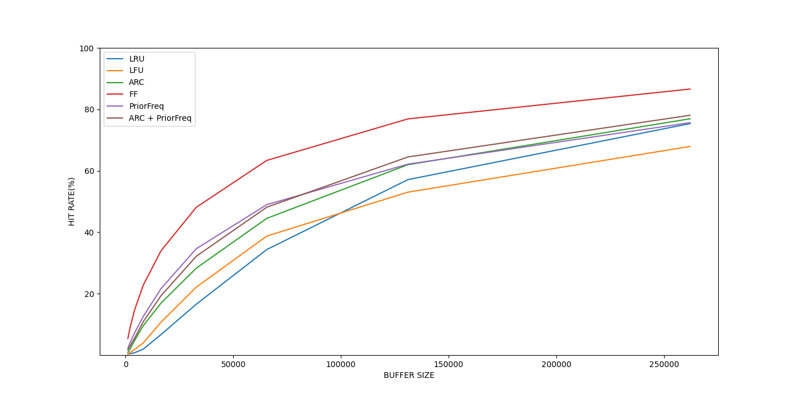

# Cache Performance Insight  

> Cache Performance Insight is a framework designed to evaluate the performance of different cache policies with 
> different workloads and configurations.

## Build
```
mkdir build && cd build
cmake .. && make
```

## Usage
```
./src/main <cache_policy> <buffer_size> <trace_file> <params>?
```

## Example
```
./src/main -h
usage: ./src/main <cache_policy> <buffer_size> <trace_file> <param_0>
       <cache_policy> -- cache policy in {LRU, LFU, ARC, ARC_2, ARC_3, OPT}
       <buffer_size>  -- buffer size
       <trace_file>   -- path of trace_file
```
```
./src/main LRU 65536 ../traces/P1.lis
LRU_CACHE_MANAGER:  buffer_size:65536 hit_count:11011495 miss_count:21043978 hit_rate:34.3514%
```

## Unittest & Coverage
```
ctest && make coverage
```

## Scripts & Visualization
### Install
```
pip install -r requirement
```

### Run
```
./scripts/test_runner.py
```
Find plot in local/plot.png:



## TODO

### Cache policies
- [x] LRU
- [x] LFU
- [x] ARC
- [x] OPT
- [x] ARC-2
- [x] ARC-3
- [x] MRF
- [ ] hybrid LRU-LFU
- [ ] ...

### Features
- [x] cmake build
- [x] unittest & code coverage
- [x] test scripts
- [x] result visualization
- [ ] log
- [ ] more parameters (e.g. scales, policies, unique keys)
- [ ] ...

### Metrics
- [x] cache hit rate
- [ ] runtime
- [ ] actual memory allocation
- [ ] concurrency
- [ ] real time cache distribution
- [ ] ...
